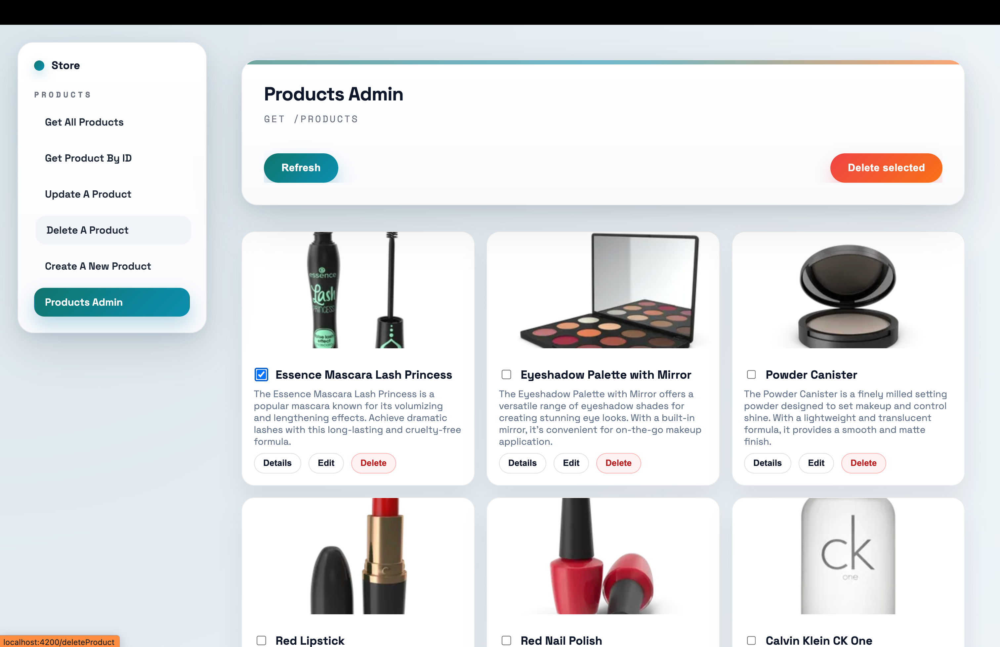

# GenerateUI CLI

Generate CRUD screens (List, Create/Edit, Delete), typed API services, and routes from your OpenAPI spec with real Angular code you can own and evolve.

Goal: stop rewriting repetitive CRUD and start with a functional, scalable UI foundation.


## What GenerateUI Does

Given an `openapi.yaml` (or `.json`), GenerateUI can generate:

- `screens.json` (detected screens/endpoints)
- one folder per feature/screen
- typed API services and DTOs
- plug-and-play routes
- basic CRUD UI (list + form + delete confirmation)
- UI states (loading / empty / error)

GenerateUI is code generation, not runtime rendering.

## Before You Start (Quick Checklist)

You will need:

- Node.js (LTS recommended)
- A valid OpenAPI v3.x file
- An Angular project (for Angular generation) > v.15
- Optional: a design system (Material, PrimeNG, internal DS)

Important:
- Incomplete OpenAPI specs (missing schemas, responses, or types) may limit what can be generated.
- Some public APIs require query params (e.g. `fields=...`). Make sure your API calls actually work.

## Installation

### Global install
```bash
npm install -g generate-ui-cli
```

### Local install
```bash
npm install -D generate-ui-cli
```

Then run:
```bash
npx generate-ui --help
```

## Recommended Workflow

GenerateUI default flow is a single command:

1. Read OpenAPI and generate schemas
2. Generate Angular code

All in:
- `generate-ui generate`

## Recommended Setup (No Paths in Commands)

Create `generateui-config.json` at the root of your Angular project:

```json
{
  "openapi": "openapi.yaml",
  "schemas": "src/generate-ui",
  "features": "src/app/features",
  "appTitle": "Store",
  "defaultRoute": "",
  "menu": {
    "autoInject": true
  },
  "views": {
    "ProductsAdmin": "cards",
    "getProducts": "list",
    "CharacterAdmin": "cards"
  }
}
```

Note: `list` is treated as table-style rendering.

## Complete Step-by-Step

1. Configure `generateui-config.json` at the project root.
   Edit it before generation whenever you want to change `appTitle`, `defaultRoute`, `menu.autoInject`, or `views`.
2. Run full generation:

```bash
generate-ui generate
```

3. Review generated files in `src/generate-ui/overlays`.
4. If needed, review generated vs override changes:

```bash
generate-ui merge --feature ProductsAdmin
```

Advanced commands:
- `generate-ui schema` -> generate schemas only
- `generate-ui angular` -> regenerate Angular from existing schemas (`--no-watch` to run once)

## 1) Default Full Generation

```bash
generate-ui generate
```

`generate-ui generate` reads paths from `generateui-config.json` when available.

What happens after this command:

- GenerateUI reads your OpenAPI and detects endpoints.
- It identifies CRUD-like operations (list, get by id, create, update, delete).
- It maps request/response schemas.
- If your project has a `src/` folder, GenerateUI creates `src/generate-ui/`.
- Otherwise it creates `generate-ui/` next to your OpenAPI file.
- Inside it you get `generated/`, `overlays/`, `screens.json`, `routes.json`, and `routes.gen.ts`.

What you should review now:

- Are all expected screens present?
- Are screen and route names correct?
- Are required query params represented?
- Do the detected fields match your API schemas?

Tip: this is the best moment to adjust naming and structure before generating code.

## 2) Advanced Commands

```bash
generate-ui schema
generate-ui angular
```

What they do:

- `schema` generates or updates `generated/` and `overlays/` from OpenAPI.
- `angular` regenerates Angular output from existing overlays.
- `angular` keeps live sync while editing `*.screen.json` (use `--no-watch` to run once).

For each screen defined in overlays, Angular generation creates:
  - a feature folder
  - list and form components (create/edit)
  - a typed API service
  - DTO/types files
  - route definitions
  - `menu.json` and `menu.gen.ts` (if present in `generate-ui/`)

Generated/overrides folders:

- `features/generated/` → generated code (always overwritten)
- `features/overrides/` → your custom edits (never overwritten)

Routes prefer `overrides/` when a matching file exists.

Tip: when you regenerate and want to see what changed, compare files with:

```bash
diff -u features/generated/<Feature>/<Feature>.component.ts \
  features/overrides/<Feature>/<Feature>.component.ts
```

Interactive merge (pick which changes to keep):

```bash
generate-ui merge --feature ProductsAdmin
```

Options:

- `--file component.ts|component.html|component.scss|all`
- `--tool code|meld|kdiff3|bc` (default: `code`)

What you should review now:

- Are files generated in the correct location?
- Does the project compile?
- Are routes correctly generated and importable?
- Does the basic UI work end-to-end?

Note:
If your project uses custom routing, standalone components, or advanced layouts, you may need to adjust how routes are plugged in.

Defaults (for advanced commands):
- `--schemas` defaults to the last generated path (stored in `~/.generateui/config.json`), otherwise `./src/generate-ui` (or `./generate-ui`)
- `--features` defaults to `./src/app/features`
- Generated files are placed under `features/generated/` and your manual edits go in `features/overrides/`

## Smart admin screens (Dev plan)

When you are logged in and Dev features are enabled, GenerateUI creates **one Admin screen per entity** when it finds a collection GET endpoint.

Example:

- `GET /products` → `ProductsAdmin`
- `GET /users` → `UsersAdmin`

If the API also includes:

- `GET /entity/{id}` → the Admin list links to a Detail screen
- `PUT/PATCH /entity/{id}` → the Admin list links to Edit
- `DELETE /entity/{id}` → Delete actions with confirmation modal

The Admin list is generated in addition to the basic screens (list, get by id, create, update, delete). It is never a replacement.

### generateui-config.json

GenerateUI creates a `generateui-config.json` at your project root on first `generate`. You can edit it to:

- inject a sidebar menu layout automatically (when `menu.autoInject` is not `false`)
- add a default redirect for `/` using `defaultRoute`
- show a custom app title in the menu (`appTitle`)

Example:

```json
{
  "openapi": "openapi.yaml",
  "schemas": "src/generate-ui",
  "features": "src/app/features",
  "appTitle": "Store",
  "defaultRoute": "",
  "menu": {
    "autoInject": true
  },
  "views": {
    "ProductsAdmin": "cards",
    "getProducts": "list",
    "CharacterAdmin": "cards"
  }
}
```

Notes:
- If `menu.autoInject` is `false`, the menu layout is not injected.
- `defaultRoute` must match a path in `routes.gen.ts` (the same path used by the router).
- You can provide either the final route path or an `operationId`; the generator normalizes it to the correct path.
- You can override the menu by adding `menu.overrides.json` inside your `generate-ui/` folder (it replaces the generated menu entirely).
- You can choose a default list view per screen (table vs cards) by adding a `views` map:

```json
{
  "views": {
    "ProductsAdmin": "cards",
    "GetProducts": "table"
  }
}
```

Example `menu.overrides.json`:

```json
{
  "groups": [
    {
      "id": "cadastros",
      "label": "Cadastros",
      "items": [
        { "id": "GetCharacter", "label": "Personagens", "route": "getCharacter" },
        { "id": "GetLocation", "label": "Localizações", "route": "getLocation" }
      ]
    }
  ],
  "ungrouped": [
    { "id": "GetEpisode", "label": "Episódios", "route": "getEpisode" }
  ]
}
```


## Login (Dev plan)

```bash
generate-ui login
```

What happens after this command:

- You authenticate your device to unlock Dev features.
- Dev features include safe regeneration, UI overrides, and unlimited generations.

## Telemetry

GenerateUI collects anonymous usage data such as CLI version, OS, and executed commands to improve the product.
No source code or OpenAPI content is ever sent.
Telemetry can be disabled by setting `telemetry=false` in `~/.generateui/config.json` or by running with `--no-telemetry`.

## Plugging Routes into Your App

GenerateUI usually creates route files such as:

- `src/generate-ui/routes.gen.ts` or `generate-ui/routes.gen.ts`

Example (Angular Router):

```ts
import { generatedRoutes } from '../generate-ui/routes.gen';

export const routes = [
  // ...your existing routes
  ...generatedRoutes
];
```

Things to pay attention to:

- route prefixes (`/admin`, `/app`, etc.)
- authentication guards
- layout components (`<router-outlet>` placement)

## Angular >= 15 (standalone) setup

Step-by-step:

1) Generate files:

```bash
generate-ui generate
generate-ui angular
```

2) Import generated routes in `src/app/app.routes.ts`:

```ts
import { generatedRoutes } from '../generate-ui/routes.gen'

export const routes: Routes = [
  // your existing routes
  ...generatedRoutes
]
```

3) Ensure `provideRouter` is used in `src/main.ts`:

```ts
import { provideRouter } from '@angular/router'
import { routes } from './app/app.routes'

bootstrapApplication(AppComponent, {
  providers: [provideRouter(routes)]
})
```

4) Check `@angular/router` is installed:

```bash
npm ls @angular/router
```

## Example Generated Structure

```txt
src/generate-ui/ or generate-ui/
  generated/
  overlays/
  routes.json
  routes.gen.ts
  screens.json
src/app/features/
  users/
    users.component.ts
    users.service.gen.ts
    users.gen.ts
  orders/
    orders.component.ts
    orders.service.gen.ts
    orders.gen.ts
```

## After Generation: How to Customize Safely

GenerateUI gives you a working baseline. From here, you typically:

- Customize UI (design system components, masks, validators)
- Add business logic (conditional fields, permissions)
- Improve UX (pagination, filtering, empty/error states)

Rule of thumb: the generated code is yours — generate once, then evolve freely.

## Overrides and Regeneration Behavior

You can edit files inside `overlays/` to customize labels, placeholders, hints, and other details. When your API changes and you regenerate, GenerateUI updates what is safe to change from the OpenAPI, but preserves what you defined in `overlays/` to avoid breaking your flow.

Even after the Angular TypeScript files are generated, changes you make in `overlays/` will be mirrored the next time you regenerate.


### Theme / colors / fonts (quick change)

The generated UI uses CSS variables. To update the entire app theme at once, edit your app's root `styles.css`:

```css
:root {
  --bg-page: #f7f3ef;
  --bg-surface: #ffffff;
  --bg-ink: #0f172a;
  --color-text: #111827;
  --color-muted: #6b7280;
  --color-primary: #0f766e;
  --color-primary-strong: #0891b2;
  --color-accent: #f97316;
  --shadow-card: 0 24px 60px rgba(15, 23, 42, 0.12);
}
```

Changing these variables updates buttons, cards, menu, inputs, and backgrounds across the app.

#### Fonts

Fonts are defined in `styles.css` as well. You can:

- swap the Google Fonts import at the top, and
- update the `font-family` on `body`.

Example:

```css
@import url("https://fonts.googleapis.com/css2?family=Manrope:wght@400;500;600;700&display=swap");

body {
  font-family: "Manrope", "Helvetica Neue", Arial, sans-serif;
}
```

## Common Issues and Fixes

### "Missing OpenAPI file"

`generate-ui generate` did not find `openapi` in `generateui-config.json`.

Fix:
```bash
# set "openapi" in generateui-config.json and run:
generate-ui generate
```

### "An endpoint exists but no screen was generated"

This may happen if:

- `operationId` is missing
- request/response schemas are empty
- required response codes (`200`, `201`) are missing

Recommendation:

- always define `operationId`
- include schemas in responses

### "Routes were generated but navigation does not work"

Usually a routing integration issue.

Check:

- if `GENERATED_ROUTES` is imported/spread
- if route prefixes match your menu
- if there is a `<router-outlet>` in your layout

## Team Workflow Recommendation

1. Update OpenAPI
2. Generate `screens.json`
3. Review `screens.json`
4. Generate Angular code
5. Customize UI and business rules
6. Commit

## Tips for Better Results

- Use consistent `operationId`s (`users_list`, `users_create`, etc.)
- Define complete schemas (types, required, enums)
- Standardize responses (`200`, `201`, `204`)
- Document important query params (pagination, filters)
- If your API requires `fields=...`, reflect it in `screens.json`

## Roadmap (Example)

- [ ] Layout presets (minimal / enterprise / dashboard)
- [ ] Design system adapters (Material / PrimeNG / custom)
- [ ] Filters and real pagination
- [ ] React support

## Contributing

Issues and PRs are welcome.
If you use GenerateUI in a company or real project, let us know — it helps guide the roadmap.

## License

MIT

## Local Files

- `~/.generateui/device.json`
- `~/.generateui/token.json`
